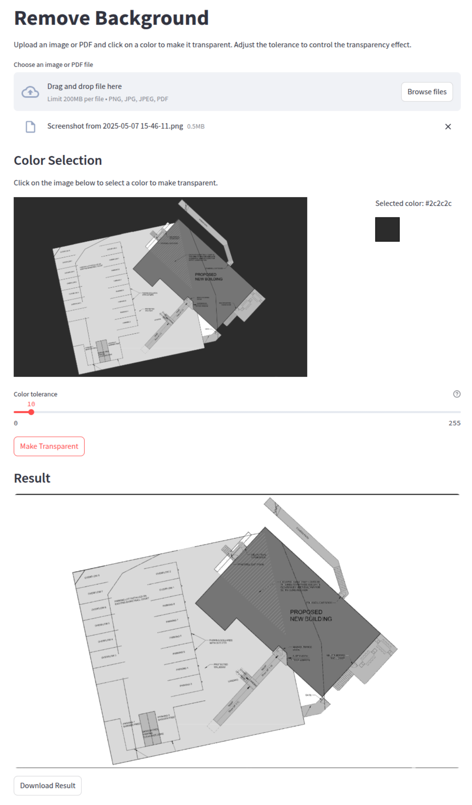

<!--- Heading --->
<div align="center">
  <h1>RMBG - Color Transparency Tool</h1>
  <p>
    A powerful Python tool for making specific colors transparent in images and PDFs, featuring both CLI and GUI interfaces.
  </p>
  <a href="https://github.com/rpakishore/remove-background">Documentation</a>
</div>
<br />


<!-- Table of Contents -->
<h2>Table of Contents</h2>

- [Screenshot](#screenshot)
- [Features](#features)
- [Getting Started](#getting-started)
  - [Prerequisites](#prerequisites)
  - [Installation](#installation)
- [Usage](#usage)
  - [Command Line Interface](#command-line-interface)
  - [Graphical User Interface](#graphical-user-interface)
- [Roadmap](#roadmap)
- [License](#license)
- [Contact](#contact)


## Screenshot


<!-- Features -->
## Features

- Make specific colors transparent in images with precision
- Process PDF documents and make colors transparent from their pages
- Support for multiple input formats (PNG, JPEG, PDF)
- Command-line interface for batch processing
- User-friendly GUI built with Streamlit
- Color selection via color picker or image clicking
- Adjustable color tolerance for fine-tuned control
- Fast and efficient processing with NumPy
- Extensible architecture for custom transparency algorithms

<!-- Getting Started -->
## Getting Started

### Prerequisites

- Python 3.12 or higher
- uv package manager (recommended)

### Installation

Clone this repository and install dependencies:

```bash
git clone https://github.com/rpakishore/remove-background.git
cd remove-background
uv sync
```

<!-- Usage -->
## Usage

### Command Line Interface

The CLI allows you to make specific colors transparent in images and PDFs:

```bash
# See all available options
uv run cli main --help

# Make white color transparent in an image
uv run cli main input.jpg output.png

# Make a specific color transparent using RGB values
uv run cli main input.jpg output.png --color 255,0,0

# Use hex color format
uv run cli main input.jpg output.png --color "#ff0000"

# Adjust color tolerance (0-255)
uv run cli main input.jpg output.png --color 255,255,255 --tolerance 20

# Process a specific page from a PDF
uv run cli main document.pdf output.png --page 0

# Set output DPI
uv run cli main input.jpg output.png --dpi 600
```

**CLI Options:**
- `--color, -c`: Target color in format R,G,B or #RRGGBB (default: white)
- `--tolerance, -t`: Color matching tolerance 0-255 (default: 10)
- `--page, -p`: PDF page number, 0-based (default: first page)
- `--dpi`: Output DPI for PNG files (default: 300)

### Graphical User Interface

Launch the GUI application:

```bash
uv run gui
```

The GUI provides an intuitive interface for:
- Uploading images and PDFs
- Selecting colors via color picker or clicking on the image
- Adjusting color tolerance with a slider
- Previewing results in real-time
- Downloading processed images

**GUI Features:**
- **Color Selection**: Choose between color picker or click-to-select on the image
- **Tolerance Control**: Adjust how similar colors should be to the target color
- **Real-time Preview**: See the transparency effect before processing
- **Multiple Formats**: Support for PNG, JPG, JPEG, and PDF files

<!-- Roadmap -->
## Roadmap

- [x] Set up a skeletal framework
- [x] Implement basic color transparency functionality
- [x] Add PDF support
- [x] Create CLI interface with Typer
- [x] Develop GUI application with Streamlit
- [x] Add color tolerance controls
- [x] Implement click-to-select color functionality
- [ ] Add support for more image formats
- [ ] Implement batch processing optimization
- [ ] Add custom transparency algorithms
- [ ] Create plugin system for extensibility
- [ ] Add background removal using AI models

<!-- License -->
## License

This project is licensed under the Mozilla Public License 2.0 (MPL 2.0) - see the [LICENSE](/LICENSE) file for details.

<!-- Contact -->
## Contact

Arun Kishore - [@rpakishore](mailto:pypi@rpakishore.co.in)

Project Link: [https://github.com/rpakishore/remove-background](https://github.com/rpakishore/remove-background)
